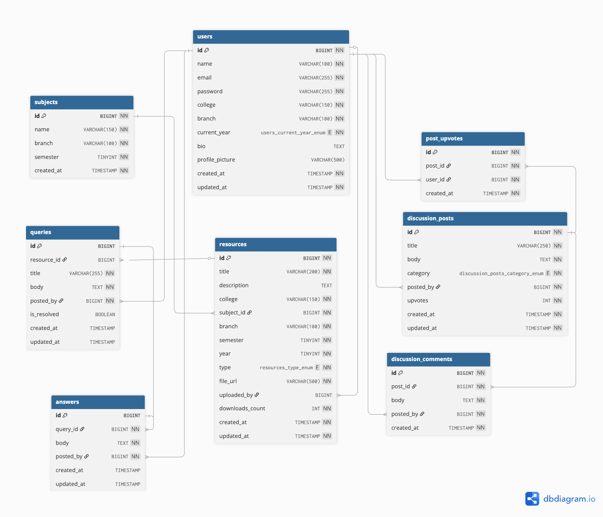
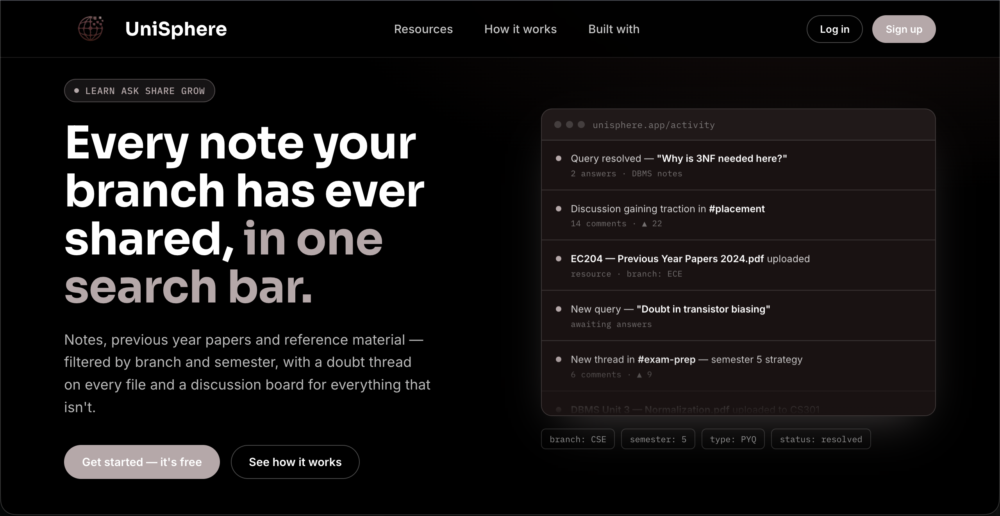
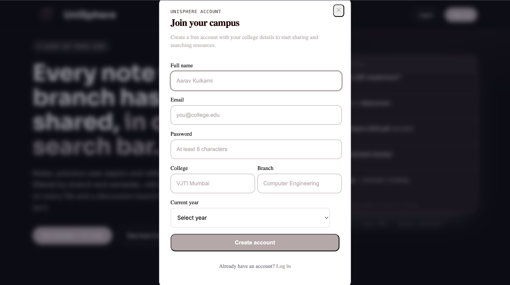
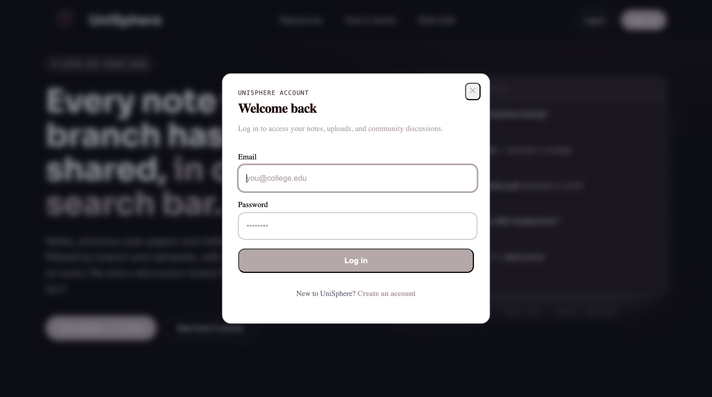
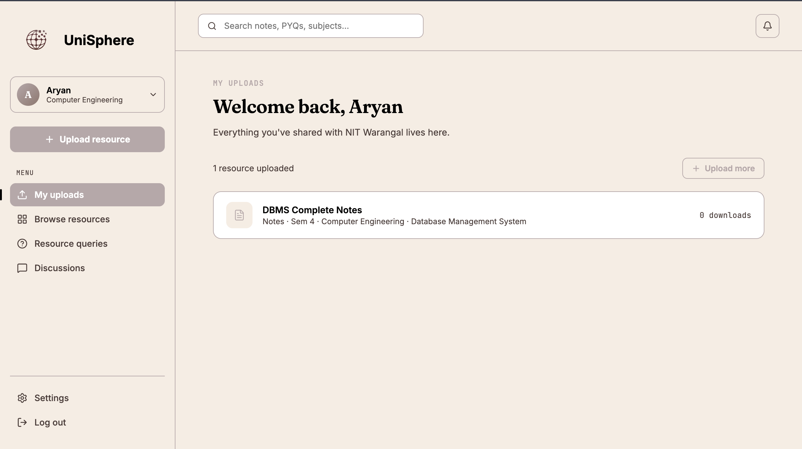
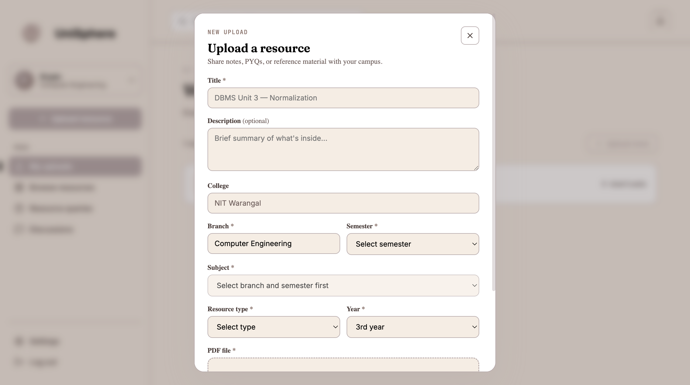
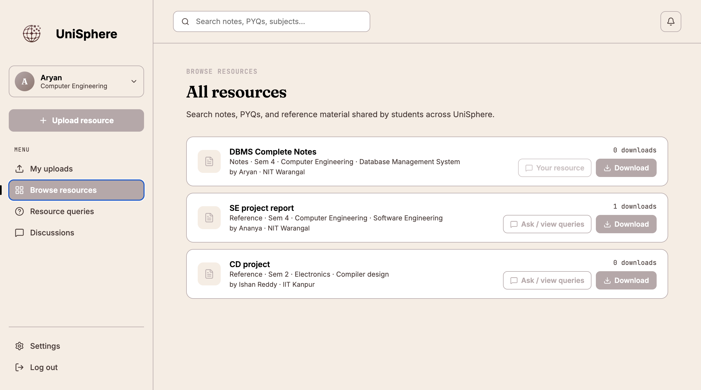
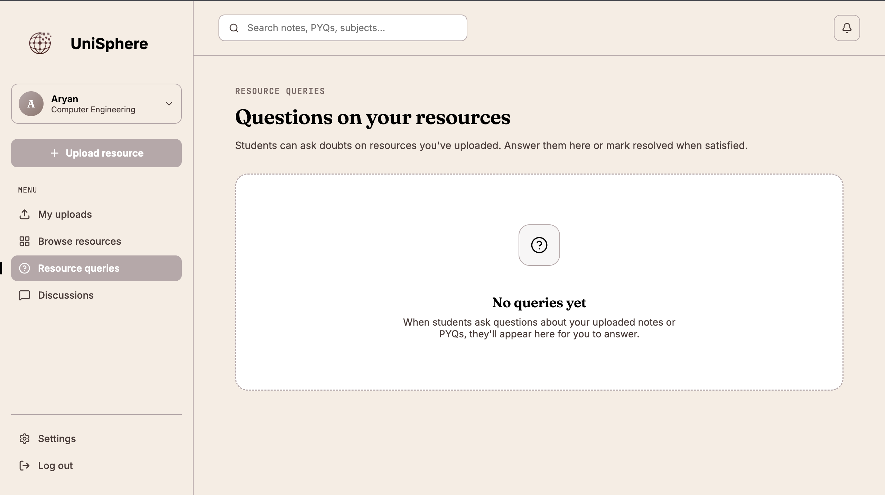
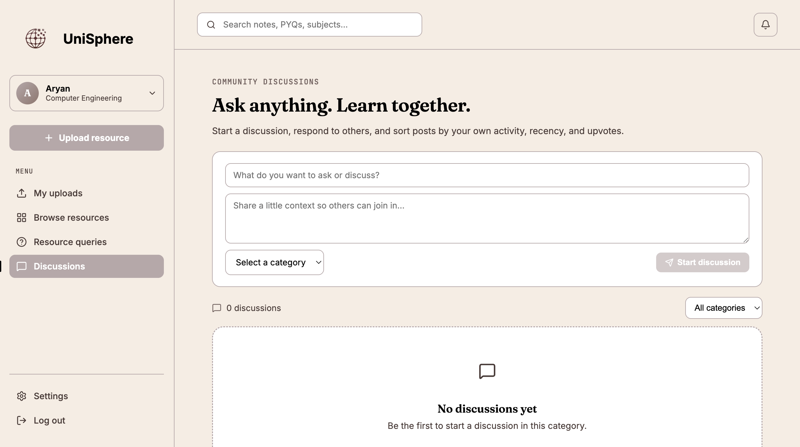
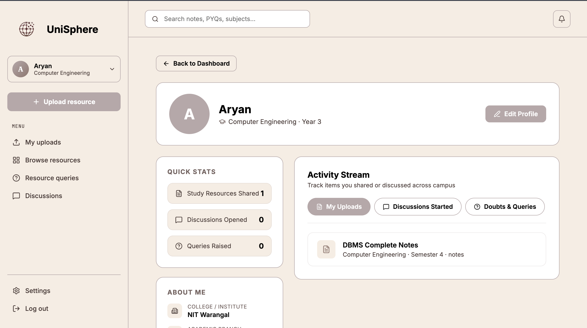

# 🎓 UniSphere – College Resource Sharing & Academic Discussion Platform

A full-stack platform built to simplify academic collaboration by enabling students to upload, discover, and discuss study resources. UniSphere provides a centralized space for sharing notes, previous year question papers, reference materials, and participating in resource-specific Q&A and community discussions.

---

## 🏗️ Tech Stack

| Layer              | Technology                          |
|-------------------|--------------------------------------|
| Frontend          | React.js, Vite         |
| Backend           | Node.js, Express.js                  |
| Database          | MySQL                               |
| Authentication    | JWT, bcrypt.js                      |
| File Storage      | Cloudinary                          |
| API Testing       | Postman                             |

---

## ✨ Key Features

- 📚 Upload and browse academic resources (Notes, PYQs, References, Lab Manuals, Assignments)
- 🔍 Search and filter resources by college, branch, semester, subject, and type
- ❓ Ask resource-specific academic queries and receive answers from other students
- ✅ Mark questions as resolved to build a collaborative knowledge base
- 💬 Community discussion forum for placements, internships, exam preparation, projects, and career guidance
- 👍 Upvote valuable discussion posts and participate through comments
- 🔐 Secure authentication using JWT and encrypted passwords with bcrypt
- ☁️ PDF storage and management using Cloudinary

---

## 🗄️ Database Relationship Schema

---

# 📸 Application Screenshots

## 1. Landing Page

## 2. User Authentication

### Register

### Login

## 3. Dashboard

## 4. Upload Resource

## 5. Browse Resources

## 6. Resource Queries

## 7. Community Discussions

## 8. User Profile

